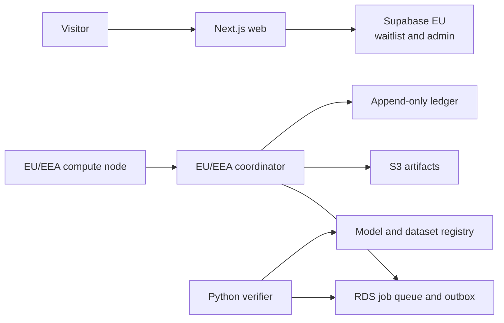

# System Architecture

## Phase Separation

Phase 1 and the compute pilot use separate trust domains.

Compromise of the public website must not grant access to the coordinator, signing keys, ledger, or
model registry.

## Components

- **Web:** public information, verified interest, future customer and contributor portals.
- **Coordinator:** node identity, capability matching, leases, heartbeats, and job state.
- **Compute client:** local policy enforcement and signed-container execution.
- **Verifier:** deterministic checks, redundant comparisons, evaluation, and quarantine.
- **Ledger:** balanced, append-only economic entries with idempotency.
- **Registry:** immutable lineage for datasets, jobs, adapters, evaluations, and releases.

## European Sovereignty Boundary

- Production identity, prompt, generated-code, ledger, signing, and model-control data remains in
  approved EU/EEA regions.
- The official control plane is operated by an EU/EEA legal entity.
- Critical state must be exportable and restorable into a second approved environment.
- Model serving must support an approved Tenvra-controlled model without an external model API.
- Community nodes receive only workload-scoped data and never unrestricted private customer
  prompts.
- Infrastructure providers require documented subprocessors, contracts, backups, and exit plans.

European control does not imply that every hardware component is manufactured in Europe. The
architecture instead reduces concentration risk with portable interfaces, multiple providers,
NVIDIA and AMD support, and tested recovery paths.

## Model Improvement Pipeline

Production models do not learn directly from live traffic. Approved data is frozen into an
immutable dataset version, processed through signed jobs, verified, evaluated, and promoted as a
signed model release. Candidate failures do not modify the active production version.

## Technology Boundaries

- TypeScript for web and coordinator.
- Go for the compute client.
- Python for ML verification and aggregation.
- PostgreSQL for transactional state.
- Object storage for immutable artifacts.
- OpenTofu for infrastructure.
- OpenTelemetry for structured telemetry without prompt content.
