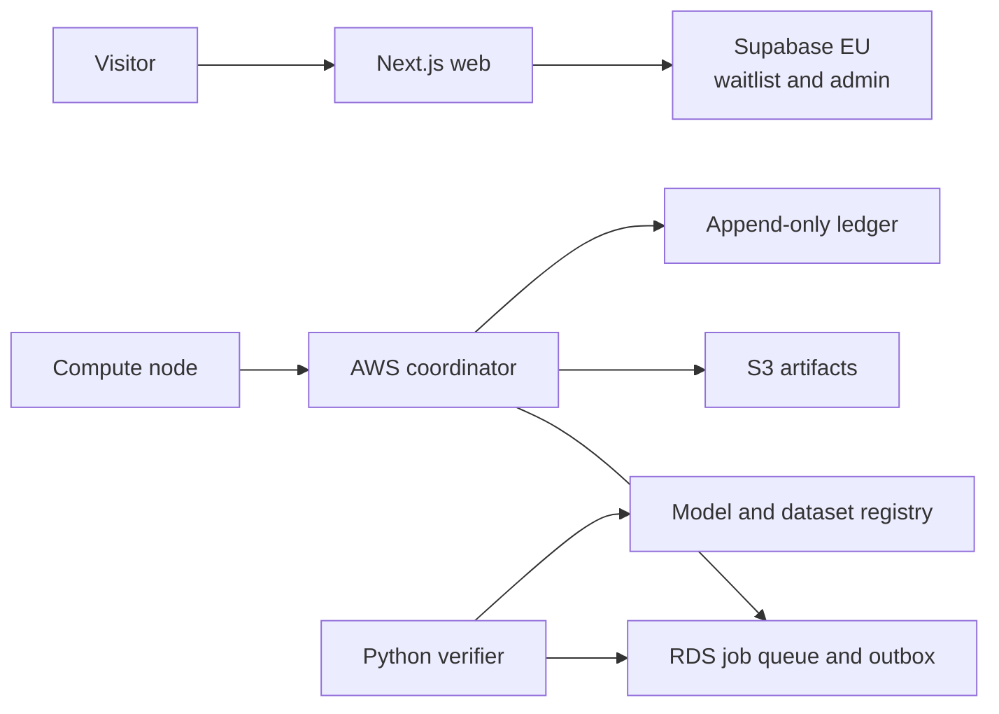

# System Architecture

## Phase Separation

Phase 1 and the compute pilot use separate trust domains.

Compromise of the public website must not grant access to the coordinator, signing keys, ledger, or
model registry.

## Components

- **Web:** public information, verified interest, future customer and contributor portals.
- **Coordinator:** node identity, capability matching, leases, heartbeats, and job state.
- **Compute client:** local policy enforcement and signed-container execution.
- **Verifier:** deterministic checks, redundant comparisons, evaluation, and quarantine.
- **Ledger:** balanced, append-only economic entries with idempotency.
- **Registry:** immutable lineage for datasets, jobs, adapters, evaluations, and releases.

## Technology Boundaries

- TypeScript for web and coordinator.
- Go for the compute client.
- Python for ML verification and aggregation.
- PostgreSQL for transactional state.
- Object storage for immutable artifacts.
- OpenTofu for infrastructure.
- OpenTelemetry for structured telemetry without prompt content.
